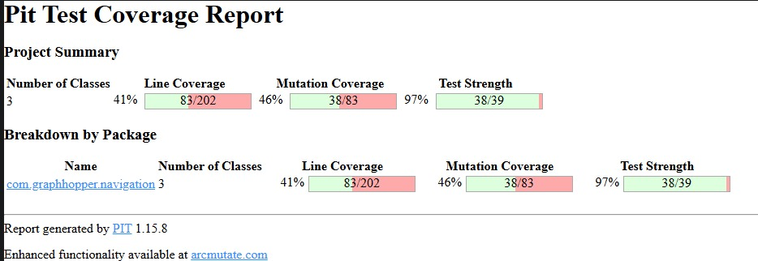
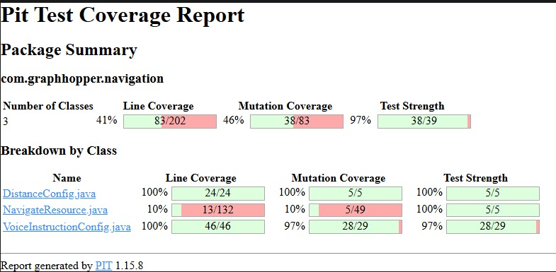
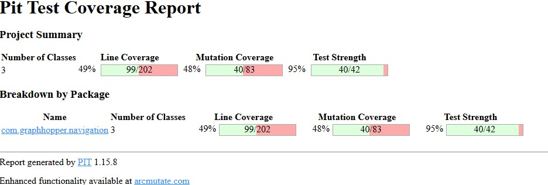
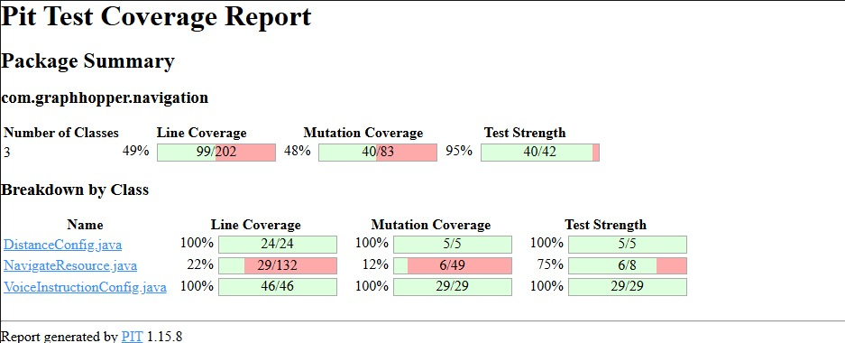
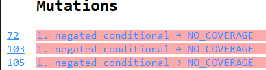
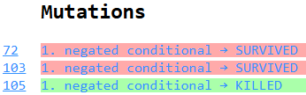

# Documentation tâche 2
### Nom du test
TestConfigImperialCar

### Intention du test
Ce test vérifie le comportement du constructeur de la classe :
```java
DistanceConfig(DistanceUtils.Unit unit, TranslationMap translationMap, Locale locale, String mode)
```
appelé avec les paramètres suivants :
unit = DistanceUtils.Unit.IMPERIAL,
translationMap = null,
locale = null,
mode = "driving".
L’objectif est de s’assurer que, lorsqu’une configuration de navigation est créée pour le mode voiture avec le système impérial (miles, feet), le constructeur initialise correctement les quatre instructions vocales attendues pour la conduite automobile.
Ces instructions sont censées couvrir les différents moments d’une navigation :
instruction initiale au départ,
deux instructions à des distances fixes,
et une instruction conditionnelle à l’approche d’un virage.

### Données
Les données du test ont été choisies pour isoler la logique liée au mode de transport et à l’unité de mesure :
Le mode "driving" est utilisé pour cibler la configuration automobile.
L’unité IMPERIAL permet de vérifier la compatibilité avec les systèmes utilisant des miles et des feet.
Les valeurs null pour translationMap et locale garantissent que le test ne dépend d’aucune configuration linguistique.
Ce choix permet de valider uniquement la structure des instructions vocales générées par le constructeur.
## Oracle
Après l’instanciation suivante :
```java
DistanceConfig dc = new DistanceConfig(DistanceUtils.Unit.IMPERIAL, null, null, "driving");
```
Le test vérifie:
```java
assertEquals(4, dc.voiceInstructions.size());
assertTrue(dc.voiceInstructions.get(0) instanceof InitialVoiceInstructionConfig);
assertTrue(dc.voiceInstructions.get(1) instanceof FixedDistanceVoiceInstructionConfig);
assertTrue(dc.voiceInstructions.get(2) instanceof FixedDistanceVoiceInstructionConfig);
assertTrue(dc.voiceInstructions.get(3) instanceof ConditionalDistanceVoiceInstructionConfig);
```
Résultat attendu du test :
La liste voiceInstructions doit contenir exactement 4 éléments.
Ces éléments doivent correspondre respectivement à :
Une instruction initiale (InitialVoiceInstructionConfig) — au début du trajet.
Une première instruction à distance fixe (FixedDistanceVoiceInstructionConfig).
Une deuxième instruction à distance fixe (FixedDistanceVoiceInstructionConfig).
Une instruction conditionnelle (ConditionalDistanceVoiceInstructionConfig).
Le test est réussi si la liste d’instructions respecte exactement cet ordre et ces types.
Cela confirme que le constructeur DistanceConfig gère correctement le mode de transport "driving" sous unités impériales, en générant une séquence complète d’instructions vocales adaptées à la conduite en voiture.
### Nom du test

TestConfigMetriclWalking

### Intention du test

Ce test évalue le comportement du constructeur :

```java
DistanceConfig(DistanceUtils.Unit unit, TranslationMap translationMap, Locale locale, String mode)
```
appelé avec les paramètres :

*   unit = DistanceUtils.Unit.METRIC
*   translationMap = null
*   locale = null
*   mode = TransportationMode.FOOT

L’objectif est de vérifier que le constructeur génère la configuration adaptée au mode de marche, une seule instruction vocale.
Dans le code de DistanceConfig, cette configuration est construite sous une condition :

```java
if (mode.equals(TransportationMode.FOOT)) {
    voiceInstructions = List.of(new ConditionalDistanceVoiceInstructionConfig(...));
}
```

Ce test confirme donc que cette branche est correctement exécutée et que la liste voiceInstructions contient bien un seul élément du bon type.


### Données

Le mode TransportationMode.FOOT permet de tester la configuration la plus minimale de la classe, car la marche ne nécessite pas d’instructions multiples comme la conduite.
L’unité METRIC permet de vérifier la configuration par défaut.
Les paramètres translationMap et locale sont laissés à null pour isoler le comportement du constructeur sans influencer la création d’instructions.

### Oracle

Après exécution du constructeur :

```java
DistanceConfig dc = new DistanceConfig(DistanceUtils.Unit.METRIC, null, null, TransportationMode.FOOT);
```

l’oracle définit les conditions suivantes :

La liste voiceInstructions doit contenir un seul élément :
    
    ```java
    assertEquals(1, dc.voiceInstructions.size());
    ```
    
    Cela prouve que le constructeur a bien créé une configuration simple pour le mode marche.

Cet élément doit être une instance de ConditionalDistanceVoiceInstructionConfig :
    
    ```java
    assertTrue(dc.voiceInstructions.get(0) instanceof ConditionalDistanceVoiceInstructionConfig);
    ```
    
    Ce type d’objet est utilisé pour générer des instructions vocales conditionnelles (par exemple, “dans 200 mètres, tournez”).
    

Le test réussit si ces deux assertions sont vraies.


***
### Nom du test

TestStreetConditionalDistance


### Intention du test

Ce test vérifie le comportement de la méthode :

```java
VoiceInstructionConfig.VoiceInstructionValue getConfigForDistance(double distance, String turn, String then)
```

de la classe ConditionalDistanceVoiceInstructionConfig.

Cette classe gère la génération d’instructions vocales, utilisées lorsque le conducteur ou le piéton approche d’une intersection ou d’un virage.

L’objectif du test est double :

Vérifier que la méthode retourne bien une configuration valide (VoiceInstructionValue) pour une distance correspondant à un palier.
Vérifier que le nom de la rue est correctement intégré dans la description vocale générée.

Le test assure donc que la génération d’instructions vocales s’adapte correctement au contenu du texte.


### **Données**


L’objet Faker est utilisé pour générer un nom de rue :

```java
Faker faker = new Faker(new Random(42));
String street = faker.address().streetName();
```


La configuration du test crée une instance de ConditionalDistanceVoiceInstructionConfig avec :

```java
new int[]{400, 200}, new int[]{400, 200}
```

Ces seuils représentent les distances (en mètres) à partir desquelles des instructions vocales doivent être émises.  
En utilisant 450 comme distance d’entrée, on cible le premier seuil (400) afin de tester le bon choix de la valeur correspondante.

Le texte "onto " + street est une phrase de navigation avec le nom de la rue.

### **Justification de l'utilisation de Faker**

L’objet Faker est utilisé uniquement pour générer un nom de rue réaliste sans recourir à des valeurs arbitraires comme "Main Street".
Cela apporte plusieurs avantages concrets dans ce test précis :

**Authenticité du scénario**
En utilisant faker.address().streetName(), on obtient un nom cohérent avec la réalité, ce qui rend le test plus représentatif du comportement attendu du système en production.

**Stabilité du test (valeur déterministe)**
La graine est fixée avec new Random(42) : le même nom de rue est produit à chaque exécution.
Cela garantit un résultat reproductible, évitant les effets aléatoires.

**Clarté de la vérification**
Le test vérifie que assertTrue(val.turnDescription.contains(street));. Donc tant que le nom généré par Faker est bien présent dans turnDescription, la condition est remplie.
Faker sert ici à donner du contenu à la chaîne "onto " + street.

### Oracle

Le test repose sur deux attentes :

Une instruction valide doit être générée :

```java
assertNotNull(val);
```

La méthode ne doit pas retourner null, puisque la distance (450 m) dépasse le plus petit seuil configuré (200 m).  
Cela confirme que la logique de sélection des paliers de distance fonctionne correctement.

L’instruction doit inclure le nom de la rue généré :

```java
assertTrue(val.turnDescription.contains(street));
```

Cela garantit que la variable street transmise via le paramètre "onto " + street est bien insérée dans la phrase finale de navigation.

Ainsi, le comportement attendu est que getConfigForDistance(450, "onto <nom_de_rue>", "") retourne une instance valide dont la description contient ce nom de rue.

Ce test démontre que la classe ConditionalDistanceVoiceInstructionConfig gère correctement :

-la génération d’instructions,
-l’insertion de texte contextuel dynamique,
-et la production d’un résultat reproductible grâce avec l’utilisation de Faker.


***
### Nom du test
TestGetBearingErreurNonNumeric

### Intention du test

Ce test vérifie le comportement de la méthode de la classe NavigateResource :

```java
static List<Double> getBearing(String bearingString)
```

Cette méthode reçoit une chaîne de caractères représentant une série d’angles de direction (bearings), séparés par des points-virgules et des virgules.  
Elle doit convertir chaque valeur avant la virgule en un nombre réel (Double) et les stocker dans une liste.

Le test évalue ici le comportement en cas d’entrée invalide, où la chaîne passée contient des caractères non numériques :

```java
NavigateResource.getBearing("abc,1");
```
Il permet de savoir si le code identifie correctement les valeurs non numériques dans la chaîne d’entrée et gère cette erreur de manière sans provoquer de plantage ni retourner une liste incomplète.
### Données

La chaîne "abc,1" a été choisie car elle reproduit une erreur de saisie: des lettres à la place d’un nombre.

Le format est valide (`,1` existe), mais le premier élément est incorrect.

Ce cas déclenche le bloc catch (NumberFormatException e) qui gère la gestion des entrées non numériques.

### Oracle

Le test devrait renvoyer une exception (IllegalArgumentException) lorsque la méthode tente de convertir "abc" en nombre.

Cette vérification est faite par :

```java
assertThrows(IllegalArgumentException.class, () -> NavigateResource.getBearing("abc,1"));
```

***
### Nom du test
TestGetBearingParseWithNaN

### Intention du test

Ce test vérifie le comportement de la méthode :

```java
static List<Double> getBearing(String bearingString)
```

de la classe NavigateResource.  
Cette méthode analyse une chaîne de caractères représentant une série de bearings (orientations en degrés), séparés par des points-virgules `;`.  
Chaque élément peut être vide (`""`) ou contenir une valeur numérique suivie d’un angle secondaire (ex. `"100,1"`).

L’objectif de ce test est de vérifier que la méthode :

- interprète correctement plusieurs valeurs valides et invalides dans une même chaîne ;  
- retourne la bonne taille de liste, en plaçant Double.NaN à la position des entrées vides.

### Données

L’entrée testée est :

```java
"100,1;;200,1;"
```

Cela permet de tester un cas où certaines valeurs sont absentes entre les séparateurs :

- `"100,1"` : première valeur valide.  
- `""` : entrée vide → doit devenir Double.NaN.  
- `"200,1"` : deuxième valeur valide.  
- `""` : entrée vide finale → doit aussi devenir Double.NaN.

Cette configuration couvre à la fois :

- la lecture correcte de valeurs numériques (100, 200) ;  
- la gestion des champs vides transformés en NaN.

### Oracle

L’oracle est défini par la liste retournée par l’appel :

```java
var b = NavigateResource.getBearing("100,1;;200,1;");
```

Le comportement attendu est :

Une liste de 4 éléments, correspondant aux quatre segments détectés par le split(";", -1) :

```java
assertEquals(4, b.size());
```

Les valeurs numériques valides doivent être correctement converties en Double :

```java
assertEquals(100d, b.get(0), 0.1);
assertEquals(200d, b.get(2), 0.1);
```

Les champs vides doivent être remplacés par Double.NaN :

```java
assertTrue(Double.isNaN(b.get(1)));
assertTrue(Double.isNaN(b.get(3)));
```

***
### Nom du test

TestDoGetStepsDesactive

### Intention du test

Ce test vérifie le comportement de la méthode :

```java
public Response doGet(
    HttpServletRequest httpReq,
    UriInfo uriInfo,
    ContainerRequestContext rc,
    boolean enableInstructions,
    boolean voiceInstructions,
    boolean bannerInstructions,
    boolean roundaboutExits,
    String voiceUnits,
    String overview,
    String geometries,
    String bearings,
    String localeStr,
    String mapboxProfile
)
```

définie dans la classe NavigateResource.
Cette méthode implémente la logique du point d’accès HTTP GET de l’API /navigate/directions/v5/gh/..., utilisée pour générer des itinéraires compatibles avec les applications de navigation.

L’intention du test est de vérifier que, lorsque le paramètre steps (ici `enableInstructions`) est désactivé (`false`), la méthode rejette correctement la requête en lançant une exception IllegalArgumentException.

Dans le code source, on trouve la condition suivante :

```java
if (!enableInstructions)
    throw new IllegalArgumentException("Currently, you need to enable steps");
```

Ce test vise donc à s’assurer que cette vérification de précondition fonctionne comme prévu.

### Données

- enableInstructions = false → paramètre désactivé pour déclencher l’exception.  
- Les autres paramètres (`voiceInstructions`, `bannerInstructions`, `roundaboutExits`) sont mis à true afin de ne pas déclencher d’autres erreurs dans les vérifications suivantes.  
- Les valeurs (`"metric"`, `"simplified"`, `"polyline6"`, `"en"`, `"driving"`) sont valides pour ne pas interférer avec le test.  
- Les objets `HttpServletRequest`, `UriInfo`, `ContainerRequestContext` sont passés à null car ils ne sont pas utilisés dans cette vérification.

Ce choix permet d’isoler la condition ciblée et de tester la gestion de steps.

### Oracle

Le test utilise l’assertion :

```java
assertThrows(IllegalArgumentException.class, () -> res.doGet(...));
```

Le test devrait donc lever une exception IllegalArgumentException, indiquant que l’option steps doit être activée pour exécuter la requête.  


***
### Nom du test

TestInitialVICBoundary

### Intention du test

Ce test évalue le comportement de la méthode :

```java
VoiceInstructionConfig.VoiceInstructionValue getConfigForDistance(double distance, String turn, String then)
```

de la classe InitialVoiceInstructionConfig.

Cette classe fait partie du module de navigation vocale et est responsable de la génération des instructions vocales initiales lorsqu’un utilisateur démarre un trajet.

Le test vise à vérifier le comportement aux valeurs limites du paramètre distance par rapport au seuil minimal configuré.
Il s’assure qu'aucune instruction n’est générée lorsque la distance est inférieure ou égale au seuil.

### Données

Les données ont été sélectionnées pour tester les trois zones critiques autour de la limite :

```java
assertNull(cfg.getConfigForDistance(4200, "turn", ""));
assertNull(cfg.getConfigForDistance(4250, "turn", ""));
var v = cfg.getConfigForDistance(4251, "turn", "");
```

- 4200 → juste en dessous du seuil → aucune instruction attendue.  
- 4250 → exactement au seuil → aucune instruction attendue.  
- 4251 → juste au-dessus du seuil → instruction attendue.

Cela permet de valider que la méthode gère correctement la comparaison (`distance > distanceForInitialStayInstruction`).

### Oracle

L’oracle repose sur la logique interne de la méthode getConfigForDistance(), qui retourne :
- null si la distance est inférieure ou égale au seuil configuré ;  
- une instance valide de VoiceInstructionValue sinon.
Dans le test, cela se traduit par :
```java
assertNull(cfg.getConfigForDistance(4200, "turn", ""));
assertNull(cfg.getConfigForDistance(4250, "turn", ""));
```
Le résultat attendu dans ces cas est donc une valeur null.

Puis :

```java
var v = cfg.getConfigForDistance(4251, "turn", "");
assertNotNull(v);
assertEquals(4000, v.spokenDistance);
assertEquals("Continue for 4 kilometers", v.turnDescription);
```

Ces assertions vérifient que, dès que la distance dépasse le seuil (4251 m) la méthode retourne une valeur non nulle (VoiceInstructionValue valide),la distance parlée (spokenDistance) est arrondie à 4000 m (selon le pas de 250 m défini dans la configuration),la phrase générée (turnDescription) correspond exactement à “Continue for 4 kilometers”.
Le test est donc réussi si getConfigForDistance() retourne null pour les distances ≤ 4250, et retourne une instance correcte de VoiceInstructionValue pour toute distance > 4250.

***
### Nom du test

TestConfigImperialCycling
### Intention du test

Ce test vérifie le comportement du constructeur de la classe :

```java
DistanceConfig(DistanceUtils.Unit unit, TranslationMap translationMap, Locale locale, String mode)
```
appelé avec les paramètres :
- `unit = DistanceUtils.Unit.IMPERIAL`
- `translationMap = null`
- `locale = null`
- `mode = TransportationMode.BIKE`
L’objectif est de s’assurer que lorsqu’on crée une configuration pour le mode vélo avec le système d’unités impérial, le constructeur initialise correctement les instructions vocales adaptées au cyclisme.


### Données

Le mode TransportationMode.BIKE est choisi pour couvrir la logique  du cyclisme, différente de celle de la marche ou de la conduite.

L’unité IMPERIAL permet de tester la compatibilité de cette logique sans l'unité par défaut.

Les paramètres translationMap et locale sont laissés à null pour concentrer le test uniquement sur la structure des instructions créées.

Ce choix de données permet de vérifier que le constructeur gère correctement la combinaison mode vélo + unités impériales, sans dépendre des paramètres de langue ou de traduction.


### Oracle

Après création de l’objet :

```java
DistanceConfig dc = new DistanceConfig(DistanceUtils.Unit.IMPERIAL, null, null, TransportationMode.BIKE);
```

le comportement attendu est le suivant :

```java
assertEquals(1, dc.voiceInstructions.size());
assertTrue(dc.voiceInstructions.get(0) instanceof ConditionalDistanceVoiceInstructionConfig);
```
Resultat attendu du test:
La liste voiceInstructions doit contenir exactement un élément.
Cet élément doit être une instance de ConditionalDistanceVoiceInstructionConfig. Le test est réussi si voiceInstructions.size() retourne 1, et si le premier élément de la liste est du type ConditionalDistanceVoiceInstructionConfig.

***
## 🔸 Analyse des mutations (Avant et après)
### Avant




### Après



## 🔸 Analyse du mutant — *NavigateResource.java*

### 1. Contexte

La classe NavigateResource gère l’API /navigate utilisée pour obtenir des itinéraires au format Mapbox.  
Avant de traiter une requête, elle vérifie le paramètre steps.  
Si ce paramètre est désactivé (steps=false), l’API ne peut pas produire de réponse valide et doit donc rejeter la requête.

### 2. Code concerné

```java
if (!enableInstructions)
    throw new IllegalArgumentException("Currently, you need to enable steps");
```
Le comportement attendu est :  
- `steps=false` → erreur lancée (refus de la requête).  
- `steps=true` → aucune erreur (requête acceptée).

### 3. Mutation générée

PIT a créé un mutant où la condition est inversée :

```java
if (enableInstructions)
    throw new IllegalArgumentException("Currently, you need to enable steps");
```
Cette inversion change la logique :  
- steps=false → plus d’erreur (accepté).  
- steps=true → erreur levée (refus).

### 4. Avant le nouveau test


Avant le nouveau test, ce chemin n’était pas couvert : la ligne if (!enableInstructions) indiquait NO_COVERAGE.
Le mutant survivait car aucun test n’appelait doGet avec steps=false en vérifiant l’exception.
### 5. Apres le nouveau test


```java
    @Test
    void TestDoGetStepsDesactive() {
        NavigateResource res = new NavigateResource(null, new TranslationMap(), new GraphHopperConfig());

        assertThrows(IllegalArgumentException.class, () ->
            res.doGet(
                null, null, null,         
                false,               
                true,                  
                true,                  
                true,                
                "metric",                 
                "simplified",             
                "polyline6",              
                "",                       
                "en",                     
                "driving"                 
            )
        );
    }
```
Ce test appelle doGet avec tous les paramètres valides sauf steps=false, afin d’isoler cette condition et de vérifier que la méthode la gère correctement.
Le test TestDoGetStepsDesactive() attend une exception pour steps=false. Dans le code original, l’exception est bien levée → le test réussit. Dans le code muté, l’exception n’est pas levée → le test échoue.
Cette différence de résultat permet à PIT de détecter la mutation : le test a mis en évidence un changement de comportement du code.
Avant ce test, la condition if (!enableInstructions) n’était pas couverte : aucun test ne vérifiait le cas steps=false.
Grâce à TestDoGetStepsDesactive(), cette partie du code est maintenant testée donc le mutant associé est détecté.

## 🔸 Analyse du mutant — *VoiceInstructionConfig.java* 

La classe InitialVoiceInstructionConfig détermine quand une instruction vocale du type “Continue for …” doit être émise pendant la navigation.  
Le comportement attendu est que cette instruction ne soit prononcée que lorsque la distance restante dépasse strictement un certain seuil, défini par la variable distanceForInitialStayInstruction.

Dans le code original, cette logique est codée ainsi :

```java
if (distance > distanceForInitialStayInstruction) {
    int spokenDistance = distanceAlongGeometry(distance);
    int distanceVoiceValue = distanceVoiceValue(distance);
    String continueDescription = translationMap.getWithFallBack(locale).tr("continue") + " " +
            this.translationMap.getWithFallBack(locale).tr("navigate." + translationKey, distanceVoiceValue);
    continueDescription = Helper.firstBig(continueDescription);
    return new VoiceInstructionValue(spokenDistance, continueDescription);
}
return null;
```

La condition distance > distanceForInitialStayInstruction impose donc que l’instruction ne soit donnée qu’au-delà du seuil.  
PIT a généré une mutation qui change cette condition en :

```java
if (distance >= distanceForInitialStayInstruction) {
    return new VoiceInstructionValue(...);
}
```

Avec cette modification, une instruction serait émise dès que la distance atteint le seuil, et plus uniquement quand elle le dépasse.  
Avant l’ajout du nouveau test, cette situation n’était pas vérifiée : aucun test ne vérifiait le comportement exactement au seuil, et le mutant n'était pas detecté.

Le nouveau test TestInitialVICBoundary() corrige cela en testant trois valeurs autour du seuil fixé à 4250 :

```java
assertNull(cfg.getConfigForDistance(4200, "turn", ""));  
assertNull(cfg.getConfigForDistance(4250, "turn", ""));  
assertNotNull(cfg.getConfigForDistance(4251, "turn", ""));
```

Ces valeurs ont été choisies pour représenter les trois situations possibles :

- 4200 : la condition est fausse (4200 > 4250 → faux) → aucune instruction,  
- 4250 :  fausse (4250 > 4250 → faux) → aucune instruction,  
- 4251 : vraie (4251 > 4250 → vrai) → une instruction est générée.  

Dans la version mutée (>=), le cas 4250 serait accepté à tort, ce qui ferait échouer ce test.
Le nouveau test cible la valeur 4250 dans laquelle la mutation fait la différence. Dans le code original, 4250 ne donne rien (null), mais dans le mutant il donne un résultat non-null. Le test permet donc de montrer cette différence et de détecter le mutant.  
Ainsi le nouveau test garantit que la condition reste strictement supérieure (`>`), ce qui préserve le comportement attendu :l’instruction vocale ne doit être donnée que lorsque la distance dépasse strictement le seuil configuré.
